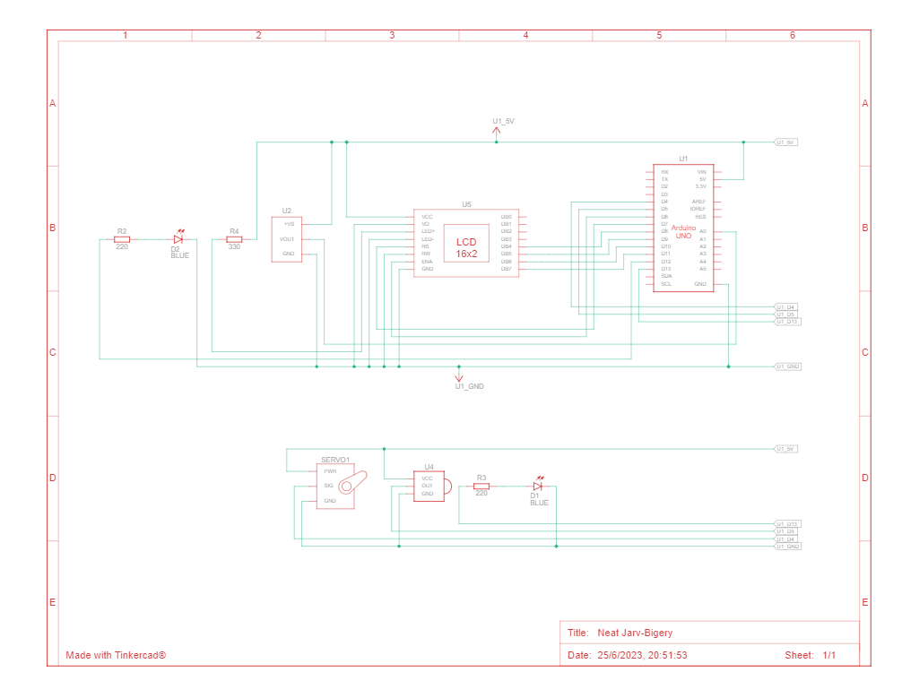

# segundo_parcial_spd_thiago-rodriguez-1D

## foto del codigo

## vista esquematica

## Descripcion
• El objetivo de este proyecto es diseñar un sistema de incendio utilizando Arduino que pueda
detectar cambios de temperatura y activar un servo motor en caso de detectar un incendio.
Además, se mostrará la temperatura actual y la estación del año en un display LCD.

Funcionamiento del Sistema de incendio con Arduino:
• Implementa un algoritmo que verifica si el boton de encendido se pulso o no, lo que hace que se encienda las leds. el servo y el sensor de temperatura.

## Función principal
    void loop()
    {
    if (ejecutarCodigo)
    {
        int lectura_sensor = analogRead(sensor_temperatura);
        float temperatura_ambiente = (lectura_sensor * 5.0 / 1024.0 - 0.5) * 100.0;

        lcd.setCursor(0, 0);
        lcd.print("Temperatura: ");
        lcd.print(temperatura_ambiente);
        delay(500);

        mostrar_estacion(temperatura_ambiente);

            if (temperatura_ambiente > 60)
            {
            servo();
            prender_apagar_led();
            }
            else
            {
            anguloServo = 0;
            miServo.write(anguloServo);
            anguloServo = 0;
            miServo.write(anguloServo);
            delay(1000);
            }
            
            if (IrReceiver.decode()) 
            {	
                Serial.println(IrReceiver.decodedIRData.decodedRawData, HEX);
                IrReceiver.resume();
                switch (IrReceiver.decodedIRData.decodedRawData)
                {
                    case 4278238976:
                    ejecutarCodigo = false;
                    digitalWrite(led_azul_1, LOW);
                    lcd.setCursor(0, 0);
                    lcd.print("                ");
                    lcd.setCursor(0, 1);
                    lcd.print("                ");
                    break;
                }
                delay(50);
                irrecv.resume();
            }
        
    }
    else
    {
        if (IrReceiver.decode()) 
        {
            Serial.println(IrReceiver.decodedIRData.decodedRawData, HEX);
            IrReceiver.resume();
            switch (IrReceiver.decodedIRData.decodedRawData)
            {
                case 4278238976:
                ejecutarCodigo = true;
            }
            delay(50);
            irrecv.resume();
        }
    }
    }